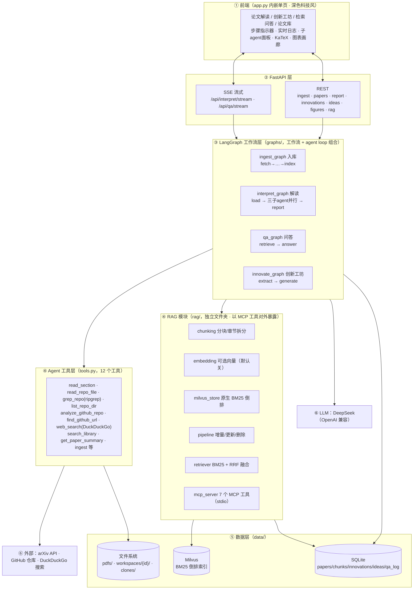
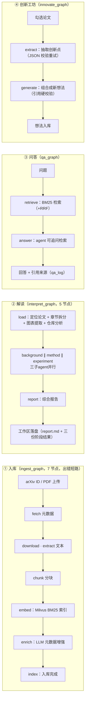
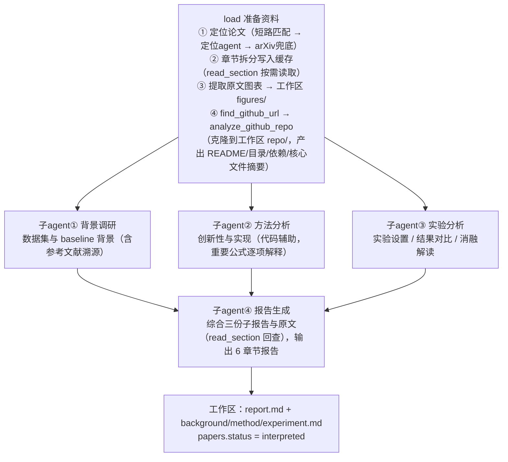
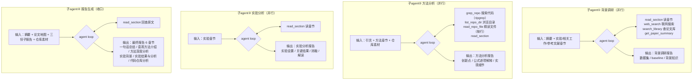

# 系统架构

## 1. 整体分层架构



## 2. 论文工作区（每篇论文独立）

论文代码与全部输出统一放在自己的工作区，删除论文时级联清理：

```
data/workspaces/{paper_id}/
  repo/             # 论文代码克隆（analyze/read/grep/list 共用一份，不重复克隆）
  figures/          # 原文图表 PNG
  report.md         # 最终解读报告
  background.md     # 背景调研阶段结果
  method.md         # 方法分析阶段结果
  experiment.md     # 实验分析阶段结果
```

## 3. 四大功能工作流总览



## 4. 解读流水线（主图）



## 5. 每个子 agent 的工作流

每个子 agent 都是独立的 prebuilt agent loop（recursion_limit=30）：模型自主决定调用哪些工具、调用几轮，直到给出最终报告；三个分析子 agent 并行执行。



## 分层说明

| 层 | 位置 | 职责 |
|---|---|---|
| 前端 | `app.py` 内嵌单页 | 三个功能入口；SSE 实时推送步骤事件与各子 agent 结果；KaTeX 公式、原文图表画廊 |
| FastAPI | `paper_agent/app.py` | REST + SSE 端点；静态资源（KaTeX、/workspaces 工作区） |
| 工作流 | `paper_agent/graphs/` | 四条 LangGraph 图：入库 / 解读 / 问答 / 创新工坊；确定性编排 + 子 agent loop |
| 工具 | `paper_agent/tools.py` | 12 个工具：章节按需读取、代码探索（grep/列目录/按行读）、仓库分析、联网搜索、检索等 |
| RAG | `paper_agent/rag/` | 分块与章节拆分、Milvus 原生 BM25 倒排索引、增量/删除、混合检索、MCP 服务 |
| 数据 | `data/` | SQLite + Milvus + 文件系统（PDF、每篇论文工作区、代码克隆） |

## 关键设计

- **工作流 + agent loop 组合**：主图确定性控制流程（顺序、并行、条件路由），节点内部委托 prebuilt agent loop 处理开放式任务。
- **解读流水线**：`load` 先做章节拆分（节省上下文）+ 图表提取 + 仓库分析，然后 background / method / experiment 三个子 agent **并行**执行，report agent 收口；各阶段结果与最终报告一并落盘到论文工作区。
- **代码探索工具链**：`analyze_github_repo` 克隆到论文工作区并出结构摘要；子 agent 用 `grep_repo`（ripgrep）定位实现 → `list_repo_dir` 浏览 → `read_repo_file` 按行精读，全程共用一份克隆。
- **背景调研联网**：背景调研 agent 持有 `web_search`（DuckDuckGo，免 key），可联网调研数据集与 baseline。
- **RAG 全走 Milvus**：原生 BM25 倒排索引（分析器分词 + SPARSE_FLOAT_VECTOR），embedding 默认关闭；开启时与稠密向量 RRF 融合。配置在 `configs/rag.yaml`，支持增量更新与删除，并以 MCP 工具（stdio）暴露给外部 agent。
- **配置**：全局参数在 `paper_agent/config.py`，RAG 参数在 `configs/rag.yaml`，凭据在 `.env`（不入库）。
